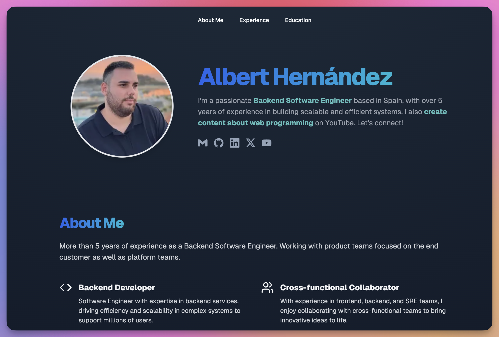

<p align="center">
  <a href="https://alberthernandez.dev/" target="blank"></a>
</p>

<h1 align="center">⭐ Albert Hernandez Website ⭐</h1>

<p align="center">
  Personal website of Albert Hernandez
</p>

<div align="center">
    <a href="#-developing">
        Developing
    </a>
    <span>&nbsp;✦&nbsp;</span>
    <a href="#-tools">
        Tools
    </a>
    <span>&nbsp;✦&nbsp;</span>
    <a href="#-deploys">
        Deploys
    </a>
    <span>&nbsp;✦&nbsp;</span>
    <a href="https://alberthernandez.dev/">
        Website
    </a>
</div>

<p align="center">
  <a href="https://nodejs.org/docs/latest-v20.x/api/index.html"></a>
  <a href="https://www.npmjs.com/"></a>
  <a href="https://nextjs.org/"></a>
  <a href="https://vercel.com/albert-hernandez-dev/website"></a>
  <a href="https://dash.cloudflare.com/ee5cacf057a2ebbe042cebfc8e8f3945/alberthernandez.dev"></a>
  <a href="https://albert-tb.sentry.io/projects/website/?project=4507794284347392&statsPeriod=14d"></a>
  <a href="https://vitest.dev/"></a>
</p>

## 🧑‍💻 Developing

There are two ways to develop in this project, using Docker or manually.

### 🐳 Docker

First, let's start by copying the `.env` file, to do so you can run:

```bash
cp .env.example .env
```

Now, you can start the app in development mode by running:

```bash
docker-compose up website
```

Also, if you want to start the app in production mode, you can run:

```bash
docker-compose up website-production
```

Now, you can open [http://localhost:3000](http://localhost:3000) in the browser to see the app running.

### ✍️ Manual

First, you need to create the `.env` file, to do so you can execute:

```bash
cp .env.example .env
```

Now, you need to configure the node environment, we recommend to use [nvm](https://github.com/nvm-sh/nvm) for it, but you can use another tool like [fnm](https://github.com/Schniz/fnm) or other:

```bash
nvm install
nvm use
```

Then, install the dependencies:

```bash
npm ci
```

After it, start the app in development mode:

```bash
npm run dev
```

Finally, open [http://localhost:3000](http://localhost:3000) in the browser to see the app running.

### ✅ Testing

To run the tests of the app, you can run:

```bash
npm run test
```

### 💅 Linting

To run the linter, execute the following command:

```bash
npm run lint
```

And for fixing lint issues automatically, you can execute:

```bash
npm run lint:fix
```

## 💼 Tools

- [Vercel](https://vercel.com/) as cloud provider.
- [Sentry](https://sentry.io/) for error tracking.
- [Cloudflare](https://www.cloudflare.com/) for firewall and security.

## 🚀 Deploys

The deployment process is automatize using GitHub Actions and Vercel. First we should merge our changes to the `main` branch, this will trigger automatically the deployment to a preview environment where we can test the correct behaviour of the application. Once we know this is working fine, we can trigger the deployment to production by running the [deploy to production](https://github.com/AlbertHernandez/website/actions/workflows/deploy-to-production.yml) workflow.

| **🌍 Environment** | **🔗 URL**                                                                                                           | **▶︎ Trigger**                                                                                                                            |
| ------------------ | -------------------------------------------------------------------------------------------------------------------- | ------------------------------------------------------------------------------------------------------------------------------------------ |
| Development        | [https://website-git-main-albert-hernandez-dev.vercel.app](https://website-git-main-albert-hernandez-dev.vercel.app) | When there is a change on `main` branch                                                                                                    |
| Production         | [https://alberthernandez.dev/](https://alberthernandez.dev/)                                                         | Manually by running [deploy to production](https://github.com/AlbertHernandez/website/actions/workflows/deploy-to-production.yml) workflow |
